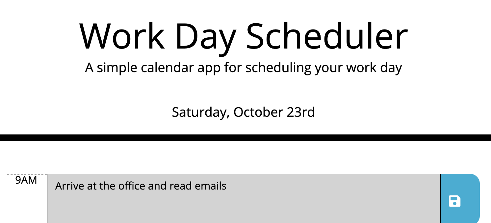

# work-day-scheduler

## Purpose
A web API allowing you to organize your work day, hour by hour, with editable tasks. Time slots change color to indicate whether they are currently in the past (gray), present (red), or future (green).

## Built With
* JQuery
* Bootstrap
* Moment.js

## Website
https://holmesmainsend.github.io/work-day-scheduler/
